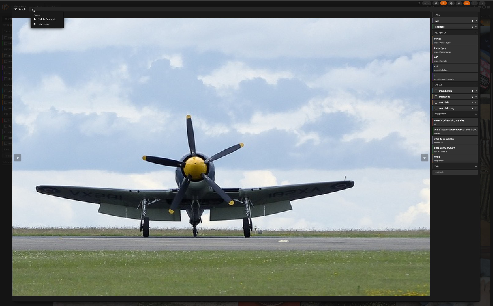
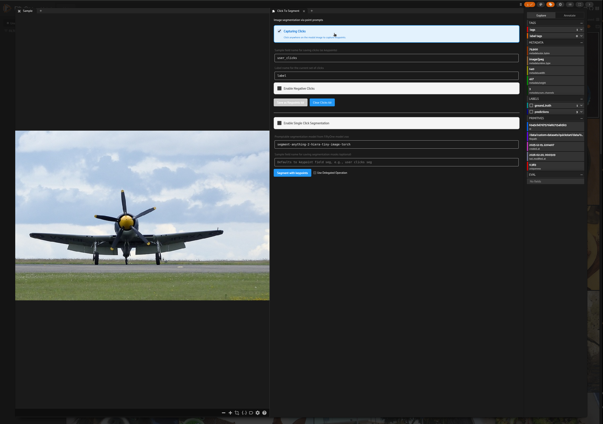
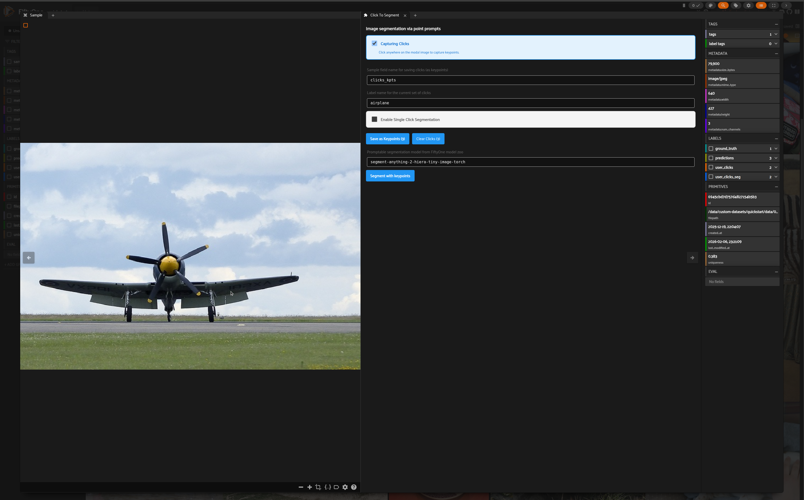
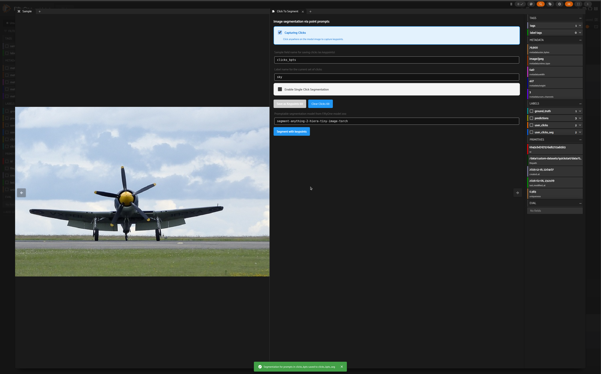
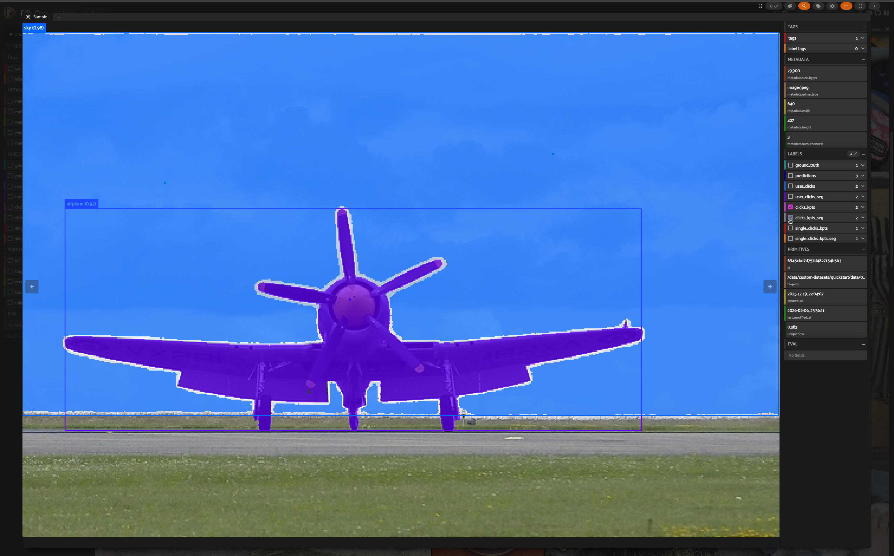
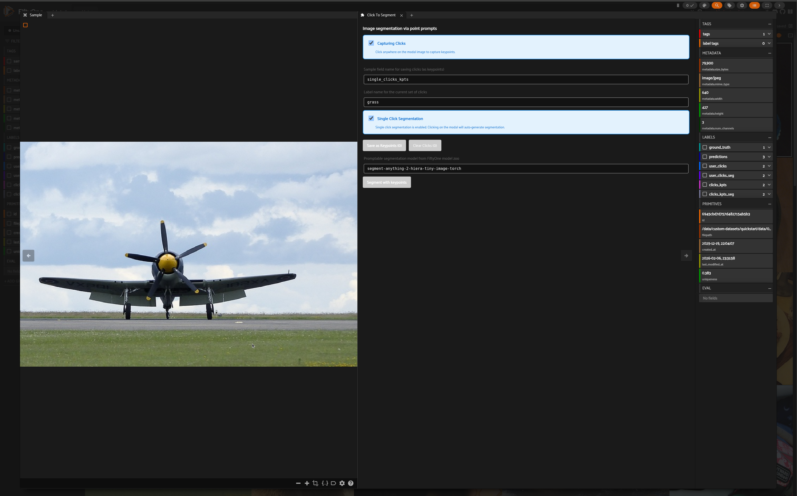
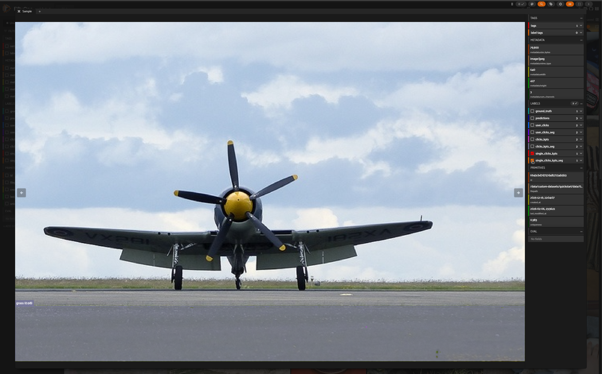

# Image segmentation via point prompts

Image segmentation via point prompts is a `fiftyone-labs` features that lets users interactively add keypoints to an image and use these keypoints for generating segmentation masks via a promptable segmentation model. There are two main components in this feaure:

1. The `click_segmentation` panel is an interactive tool for generating point prompts via clicks on the `Sample` modal. These point prompts can be input to a promptable segmentation model (such as Segment Anything Model) to create segmentation masks.

2. The `segment_with_prompts` operator is a standalone operator that can be used to run a promptable segmentation model with either box or keypoint prompts saved in a sample field. The operator may be applied to the entire dataset or a subset of the dataset.

## Usage

### Click To Segment Panel

```python
import fiftyone.zoo as foz
import fiftyone as fo

dataset = foz.load_zoo_dataset("quickstart")
# For a smoother experience, ensure that samples have metadata.
if dataset.count("metadata") != len(dataset):
    dataset.compute_metadata()

session = fo.launch_app(dataset)
```

_Select a sample and open Click To Segment panel_



_Enable capture mode by checking the box_



The panel has two modes of operation:

- [Multiple Click Capture](#multi-click-mode): Users can save multiple sets of clicks and manually trigger segmentation.
- [Single Click Capture](#single-click-mode): Users can click on the sample modal and segmentation will auto-triggered.

#### Multiple Click Capture

_In the Sample modal, add a set of clicks for airplane and save as keypoints_



_Add another set of clicks for sky and save as keypoints_


NOTE: Clicked points are currently not rendered in the Sample modal. You can view them via the keypoints label field.

_Choose a segmentation model from FiftyOne model zoo and click on Segment with Keypoints button_



_Segmentation masks will be added to the Sample_



#### Single Click Capture

_In the Click To Segment panel, enable single click segmentation by checking the box_



_Add a click on the Sample modal to trigger auto-segmentation_


