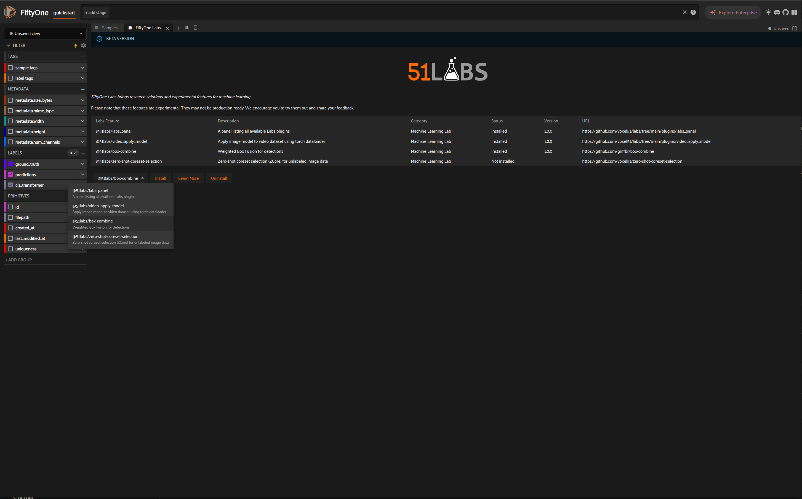

# Labs Panel

Labs Panel offers a convenient way to see the available Labs features, their installation status and versions, and an easy interface to manage these features.

## Usage

### Via FiftyOne App

```python
import fiftyone.zoo as foz
import fiftyone as fo

dataset = foz.load_zoo_dataset("quickstart")
session = fo.launch_app(dataset)
```


_Select FiftyOne Labs panel_


