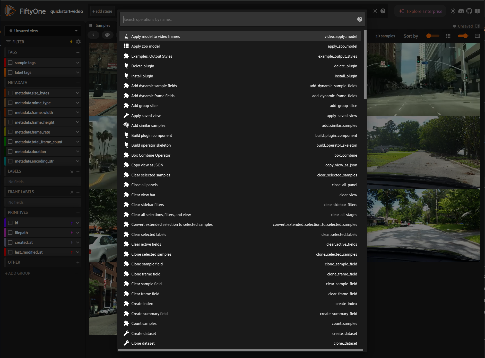
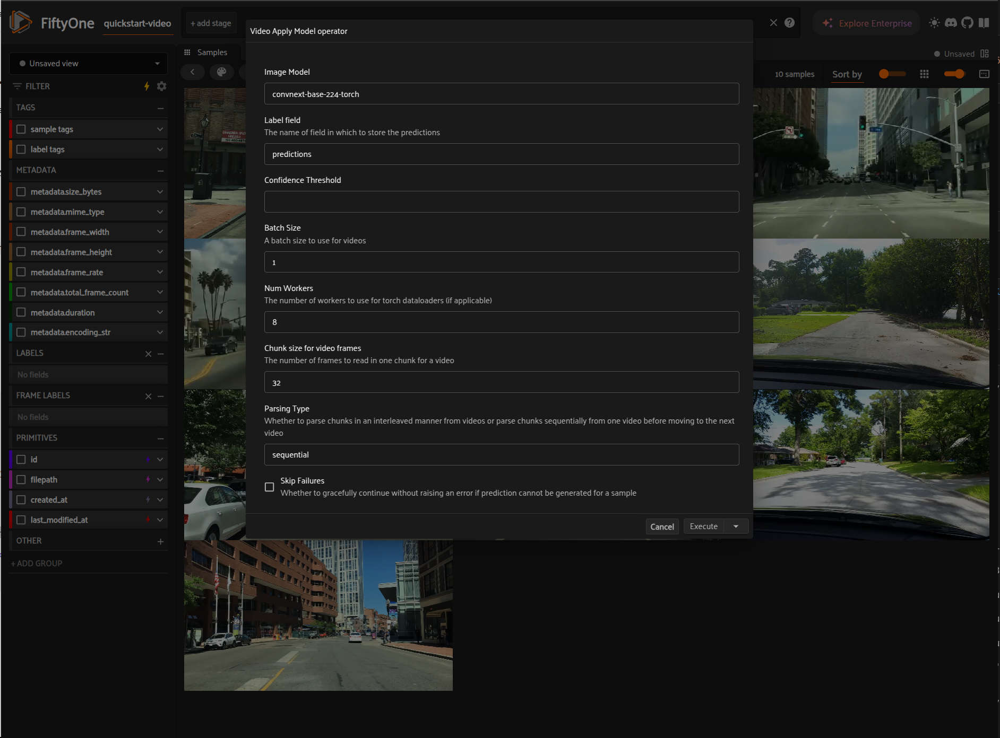

# Apply image model to video frames

The `video_apply_model` operator offers a torch dataloader for loading videos frames from a FiftyOne video dataset and applying the image model to each video frame.

This Labs feature supports reading videos from a FiftyOne video dataset via `model_inference.TorchVideoFramesDataset` which uses FFmpeg decoder and loads chunks of frames from each video.

## Usage

### Via FiftyOne App

```python
import fiftyone.zoo as foz
import fiftyone as fo

dataset = foz.load_zoo_dataset("quickstart-video")
session = fo.launch_app(dataset)
```



_Select video_apply_model operator_



### Via code

```python
import fiftyone.zoo as foz
from labs.plugins.video_apply_model import model_inference

dataset = foz.load_zoo_dataset("quickstart-video")
model = foz.load_zoo_model("clip-vit-base32-torch")

model_inference.apply_image_model_to_video_frames(
    dataset,
    model,
    label_field="predictions",
    frames_chunk_size=64,
    num_workers=8,
    confidence_thresh=0.5,
    skip_failures=True,
    parse_type="sequential",
)
```

## TODOs

- Add support for model class filtering
